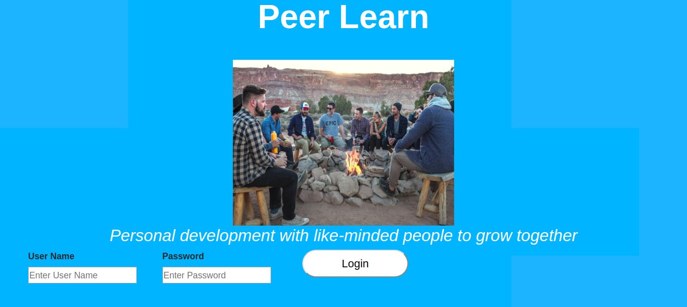
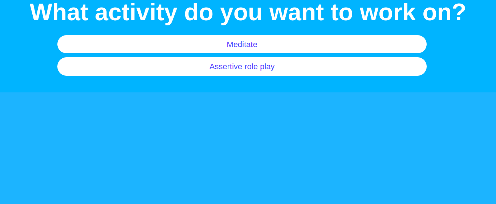
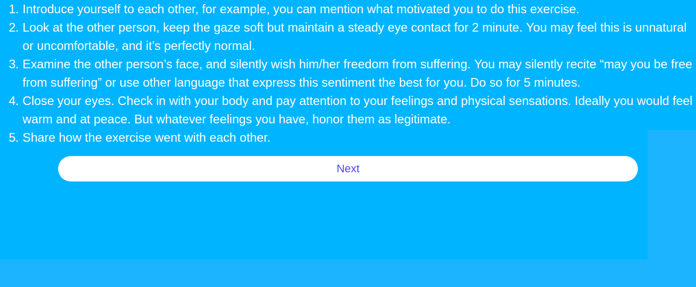

#Peer Learn - Bring People Together to Practice Good Mental Health

##The Problem

Many adults ages 21-40 have a strong interest in cultivating emotional intelligence but don’t know where to start or find a community to learn with. A very significant percentage of people with depression and anxiety have not improved from medication or psychotherapy. The right tools are missing for both personal development enthusiasts and a segment of those suffering from depression and anxiety.

Today, there are many meditation & CBT apps for individuals (e.g. Headspace, Pacifica), and social media-based video apps (e.g. SnapChat). The mental exercise knowledge and video technology are both mature yet there is no peer-to-peer video app dedicated to proactively co-learning mental health exercises.

##Our Solution

A video app to connect two peers on-demand to work through a mental health exercise.

It combines 3 unique benefits in a 15-min video session 1) Scientifically proven learning instructions 2) Role model 3) Emotional support

## Built With
* Javascript
* HTML
* CSS
* Bootstrap
* React
* Tokbox API
